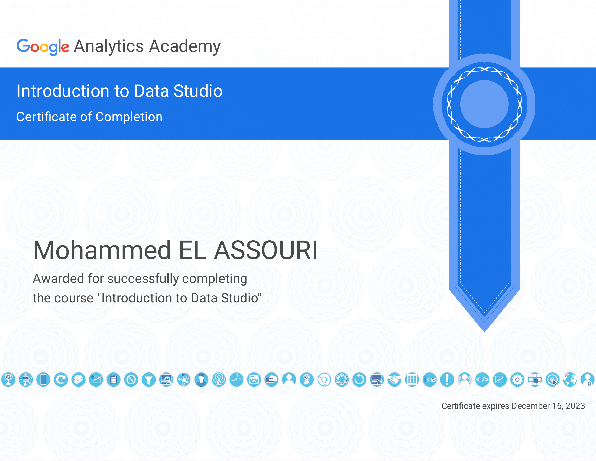
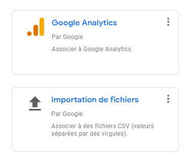
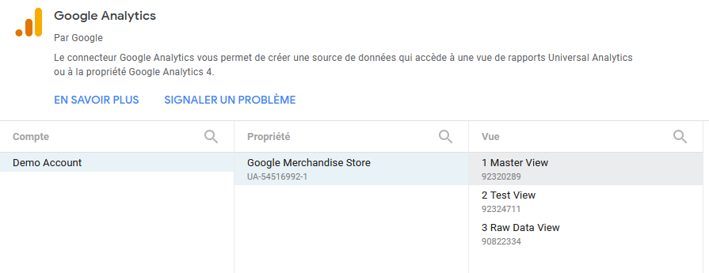
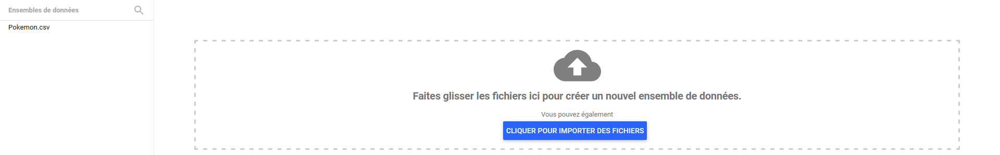

# Liens Dashboard

[Dashboard Stats Pokemon](https://datastudio.google.com/reporting/d6370320-d151-4298-acb5-1b8ed50b83cc)

[Dashboard Marchandise Google](https://datastudio.google.com/reporting/79be6669-071b-4522-97af-35f09d83b2bd)

# Liens Certificat 

# La méthode d'ingestion des données    

Pour la méthode d'ingestion des données etant données que j'ai suivi un tuto puis fais un dashboard tout seul j'ai été amené a manipulé 
en source : 

* **google analytics** 

* **fichier csv** 

# Explication du choix des données

J'ai réalisé l'exercice en deux temps, j'ai d'abord suivi un tuto qui me montrait comment utiliser les données google
analytics avec le compte démo de google, puis j'ai pris un dataset basique, un csv que j'ai récupérer sur [kaggle](https://www.kaggle.com/abcsds/pokemon).

Je n'ai pas trouvé de difficulté particulière à suivre le tuto dans un premier temps. Néanmoins, la difficulté principale n'est pas tant de réaliser des graphiques, mais plutôt de réaliser des graphiques pertinents avec une bonne lisibilité.

J'ai donc essayé par la suite avec le deuxième dataset qui concerne les stats des pokemons de mettre en avant des données intéressantes :
* Attaque en fonction du type
* Defense Sp. en fonction du type
* Repartion des pokemon en fonction du type
* Top Attaque Pokemon

Un avec une charte graphique jaune orange (Pikachu)

Mon ressenti: J'ai malgré tout encore un peu de mal à sélectionner la bonne visualisation en fonction des données dont je dispose. Mais je pense qu'avec de la pratique en milieu professionnel,
je pourrais rapidement monter en compétences.

# Les sources 

[kaggle](https://www.kaggle.com/abcsds/pokemon)
Le site sur lequel j'ai récupérer mon dataset pokemon.

[Tuto compte demo google](https://www.youtube.com/watch?v=4xmyomDMnnc&t=330s)
Le tuto que j'ai suivi pour démarrer sur google data studio.

Dans ce tuto, on apprend à faire un dashboard avec des stats marketing. J'ai suivi sans chercher plus loin, je n'ai malheureusement pas les compétences nécessaire pour comprendre.
Les données manipulées.
Néanmoins, j'ai pu faire le tour d'un bon nombre d'outils de visualisation et de quelque fonctionnalité intéressante comme les cartes de densité et les barres dans les tableaux.
J'ai également appris comment styliser les éléments de mon dashboard.

[tips](https://www.solution-bi.com/6-cles-pour-creer-le-tableau-de-bord-ideal/)
Des conseils synthétisé plus ou moins semblable à ceux de M. CONNESSON.
